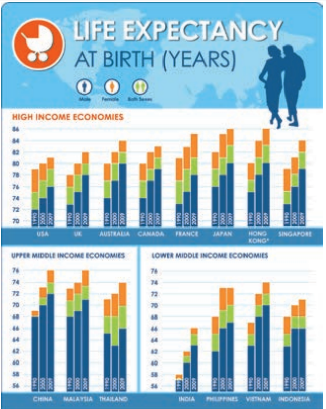

# Knight Center MOOC : "[Data Visualization for Storytelling and Discovery](https://journalismcourses.org/DE0618.html)"
###### 11/6/18 - 8/7/18

Alberto Cairo

## Syllabus
### Module 1: What is data visualization
This week offers an introduction to visualization, what it is, how it works, and what ethical considerations are involved in its design. It also teaches how to prepare data before visualizing it. This week you will learn:

* What data visualization is
* Visualization ethics: How visualization may mislead, and how it can tell the truth
* Data preparation: an explanation of the software videos this week

WK1 Exercise :

"_Based on what you’ve learned on the video lectures and the readings, see the following two graphics and write a critique of at least one of them; then, engage in conversation with other students_"

---

### Module 2: Data exploration
This week covers how visualization can be used to explore and discover features that often hide behind data. We’ll use software tools that will allow us to import a data set and then visualize it in multiple ways to reveal patterns and exceptions to those patterns. This week you will learn:

* INZight for data exploration
* How to find outliers when analyzing data.
* Using histograms and seeing summary statistics
* Scatter plots. Trends and outliers
* Using maps

WK2 Exercise :

"_Look for an interesting data set in public sources (https://data.worldbank.org/ or any other public source for global, national, or local data), explore it, and write down what interesting features you've find in it. Send your contribution to the forum. Comment on at least the contributions of 3 other students_"

---

### Module 3: Visualization for communication
This week explains how visualization can be used to communicate with the public. We’ll use a new tool, Flourish, to design static and interactive maps and charts, and then put them together in sequential narratives. This week you will learn:

* How to choose graphic forms for your data
* Stories with charts and maps
* Visual design for communication
* Software tools: an introduction to this week’s practical videos

WK3 Exercise :

"_Take the U.S county data set I used in the Flourish tutorials — or any other similar data set you wish. Select one of the potential stories you spotted, do more research about it, and then design a visualization or a series of visualizations to tell that story. Send a message to the discussion forums with a link to your project and a short description of it. Critique at least TWO other projects by other students_"

[https://public.flourish.studio/story/11341/](https://public.flourish.studio/story/11341/)

> [I did this on 11/7, but unfortunately lost my original post/notes when the platform shut down. So I'll make brief comments, and try to answer questions if there are any.]

> I'd been through the Flourish tutorials, and wanted to practice with that tool. I had the County data and was interested to see if it was interesting!

>I wanted to avoid simply creating extra columns in Excel to get around difficulties/unfamiliarity. I was willing to look for other datasets if I found a story (especially if I could combine them in Flourish).

>The data (and absence of a time field) limited the chart types I considered would be interesting. I also couldn't make Flourish aggregate the County data into State/Region totals (the way I think Tableau could?).

>I wanted to try out the structure of a story, even if the data didn't support something 'compelling' ...and I don't think it did.

>So, I tried to set the scene and then looked at whether Poverty% might be linked to voting patterns. (And I tried other variables too, but didn't save them.)

>I found Flourish quite 'clunky' for this - trying to keep in mind what point I was trying to make, across several slides, when it was so slow to load each one and didn't show thumbnails of the actual charts. (And I'd have used colours in some slide titles, but couldn't find a way. Same for some other things. I'd have liked to put comments on the face of charts, but couldn't, so think I would next put a lot more detail in the slide title ...which I don't think it was designed for).

---

### Module 4: Final project and next steps
We’ll use this week to design a visualization based on a topic and datasets of your choice. This week you will learn:

* Other resources you can consult to keep learning about visualization.
* Live Hangout: An Interview with Google News Lab’s Simon Rogers

WK4 Exercise :

"_Do your research and design your visualization. Submit it via the discussion forums as a link and a short description. Give feedback to at least TWO other students_"

---

